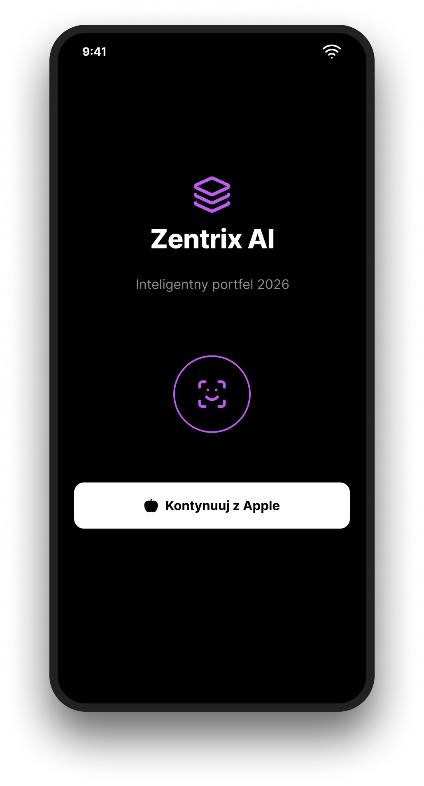
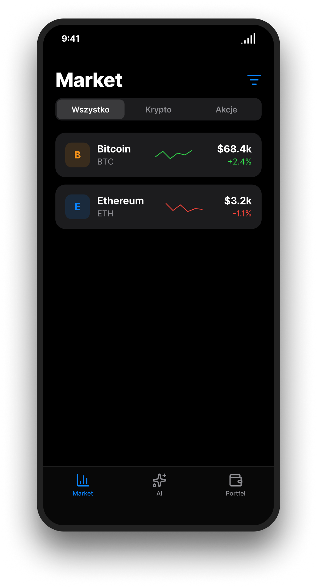
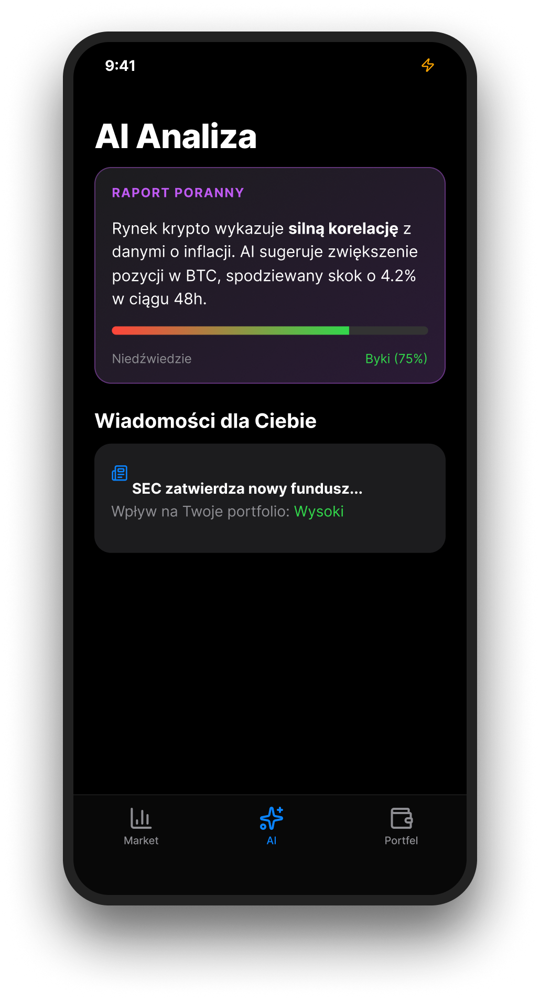
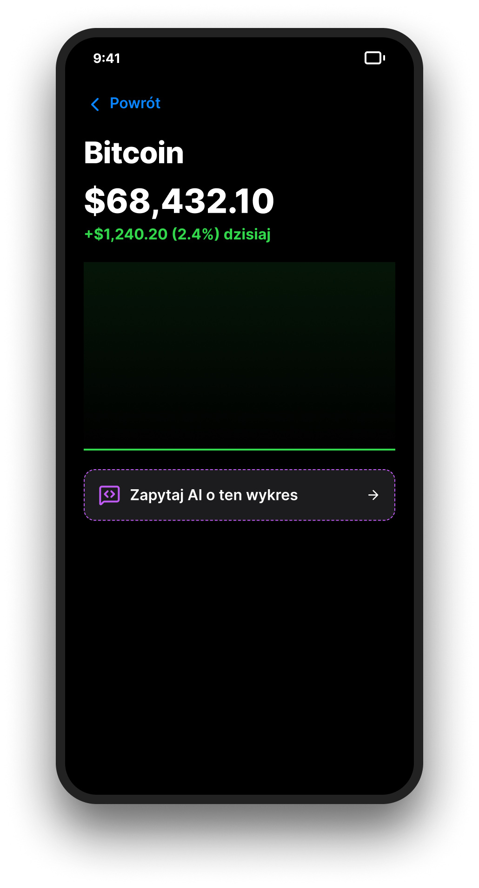

# ⚡ Zentrix AI — Next-Gen iOS Investment Intelligence

**Zentrix AI** to autorski projekt ekosystemu mobilnego, który redefiniuje sposób interakcji z danymi finansowymi. Aplikacja nie tylko dostarcza surowe notowania kryptowalut i akcji, ale pełni rolę osobistego analityka finansowego działającego w czasie rzeczywistym.

---

## 💎 Wizja Projektu
W dobie szumu informacyjnego, **Zentrix AI** stawia na selekcję. Zamiast zmuszać użytkownika do czytania setek newsów, aplikacja wykorzystuje modele LLM (Large Language Models) do syntezy kluczowych zdarzeń rynkowych, bezpośrednio wpływających na posiadany portfel.

### 🚀 Główne Filary UX

* **Adaptive Intelligence:** Interfejs zmienia się w zależności od nastrojów rynkowych (np. subtelne akcenty kolorystyczne przy wysokiej zmienności).
* **Zero-Click Insights:** Najważniejsze wnioski AI są widoczne natychmiast po autoryzacji FaceID, bez konieczności przeklikiwania się przez menu.
* **Predictive Sentiment:** Wykorzystanie analizy lingwistycznej do przewidywania nastrojów tłumu przed wystąpieniem gwałtownych ruchów cenowych.

---

## 📱 Architektura Interfejsu (iOS Case Study)

Projekt został podzielony na 4 kluczowe fazy interakcji, zoptymalizowane pod kątem obsługi jedną ręką na urządzeniach iPhone:

| Faza | Moduł | Kluczowa Interakcja |
| :--- | :--- | :--- |
| **01. Secure** | **Biometric Gate** | Natywna autoryzacja FaceID z fallbackiem do kodu systemowego. |
| **02. Observe** | **Smart Watchlist** | Haptic Feedback przy scrollowaniu i gesty Swipe dla szybkich akcji. |
| **03. Understand** | **AI Nexus** | Dynamiczny Dashboard z agregacją sentymentu i podsumowaniem 120min. |
| **04. Analyze** | **Deep Dive & Chat** | Czat kontekstowy zintegrowany bezpośrednio z osią czasu wykresu. |

---

## 📸 Wizualizacja Prototypu

  
  
  
  

---

## 🏗️ Stack Technologiczny (Planowana Implementacja)
Projekt zakłada wykorzystanie najnowszych frameworków od Apple:
* **SwiftUI 5.0:** Do budowy responsywnego i płynnego interfejsu.
* **Swift Charts:** Zaawansowana wizualizacja danych giełdowych z obsługą gestów.
* **Combine:** Reactive programming do obsługi strumieni danych rynkowych (WebSockets).
* **CoreML:** On-device processing dla podstawowych analiz sentymentu (prywatność danych).

---

## 👨‍💻 O Autorze
* **Student:** Danila Vialihka
* **Semestr:** 6 (Informatyka)

---
